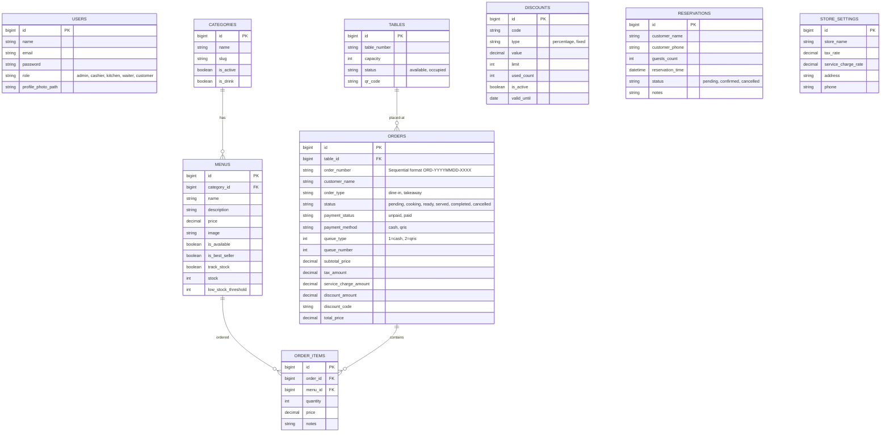
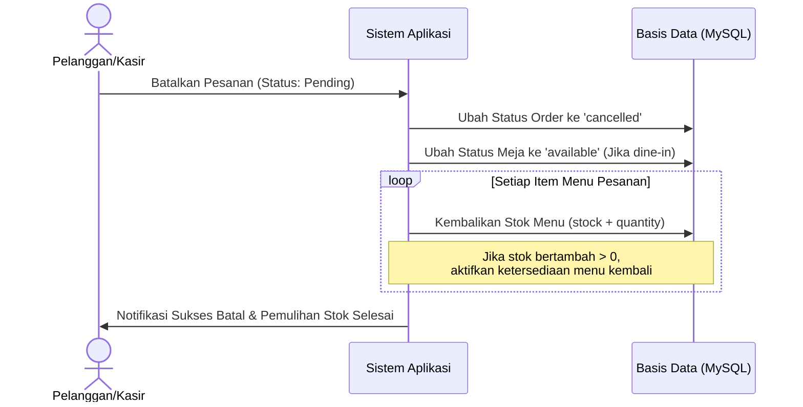
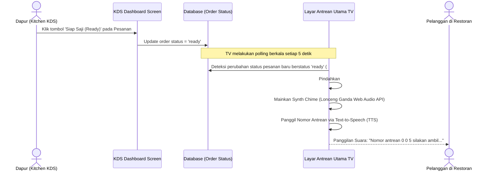

# Dokumentasi Desain UI/UX & Arsitektur Sistem — YON RESTO

Dokumen ini menyajikan panduan komprehensif mengenai konsep desain UI/UX, sistem warna, struktur navigasi, seluruh fitur sistem berdasarkan peran pengguna, skema database, serta alur interaksi (*user flows*) pada aplikasi **YON RESTO** (Laravel 13 + Livewire 3 + Tailwind CSS).

---

## 1. Konsep & Sistem Desain (Design System)

Aplikasi **YON RESTO** dirancang dengan pendekatan estetika **modern fluid-memphis**, memadukan lengkungan dinamis (*large rounded corners*), bayangan lembut (*soft shadows*), dan pola geometris mikro (*micro-patterns*) untuk memberikan impresi premium dan profesional.

### 🎨 Palet Warna Brand (Color Tokens)
Sistem warna dikurasi secara harmonis untuk merepresentasikan kehangatan kuliner, kesegaran bahan makanan, serta kenyamanan pelayanan.

| Token Warna | Nilai Heksadesimal (Hex) | Kegunaan Utama | Representasi Psikologis |
| :--- | :--- | :--- | :--- |
| **Brand Orange** | `#F5A623` | Warna aksen utama, status peringatan, persiapan antrean | Kehangatan Kuliner & Nafsu Makan |
| **Brand Yellow** | `#F8C23A` | Warna sorotan terbaik (*best seller*), aksen tombol cerah | Keriangan, Energi & Kecepatan |
| **Brand Green** | `#7ED321` / `#10B981` | Tombol positif (Checkout, Simpan), status sukses, antrean siap | Kesegaran Bahan & Kepercayaan |
| **Brand Cream** | `#FCFAF2` | Latar belakang (*background*) mode terang | Kebersihan & Kenyamanan Ruang |
| **Slate Dark** | `#0B0F19` / `#0F172A` | Latar belakang mode gelap & layar antrean TV | Kemewahan & Fokus Kontras Tinggi |

### ✍️ Tipografi (Typography)
- **Font Utama**: **Outfit** (diambil dari Fonts Bunny Google Fonts API). Font sans-serif geometris ini memiliki karakteristik bulat (*rounded*) yang memberikan nuansa modern, ramah, dan sangat mudah dibaca baik di layar TV restoran, tablet POS kasir, maupun handphone pelanggan.
- **Hierarki Font**:
  - Judul Utama & Nomor Antrean: *Black* / *Extrabold* (Outfit 800/900)
  - Label & Header Panel: *Bold* / *Semibold* (Outfit 600/700)
  - Isi Teks & Deskripsi Menu: *Medium* / *Regular* (Outfit 400/500)

---

## 2. Struktur Navigasi & Rute (Routes)

Sistem dibagi menjadi rute publik (Pelanggan) dan rute terproteksi (Staf/Admin) berbasis peran (*role-based authorization*).

```mermaid
graph TD
    A[Rute Publik] --> B[Home / Dashboard Pelanggan: '/']
    A --> C[Order Mandiri: '/order']
    A --> D[Lacak Antrean Pelanggan: '/track/{order_number}']
    A --> E[Layar Antrean Utama TV: '/queue']
    
    F[Rute Terproteksi Staf] --> G[Dashboard Staff: '/dashboard']
    F --> H[Kasir POS Terminal: '/cashier/terminal']
    F --> I[Kasir POS Dashboard: '/cashier/pos']
    F --> J[Dapur KDS: '/kitchen/kds']
    F --> K[Admin Panel: '/admin/*']
```

---

## 3. Fitur Utama Berdasarkan Peran (Roles)

### 📱 A. Pelanggan Mandiri (Customer Self-Ordering)
Pelanggan dapat melakukan pemesanan langsung dari meja masing-masing dengan memindai kode QR.
- **Pemesanan Fleksibel (Dine-In / Takeaway)**: Sakelar interaktif untuk memilih makan di tempat (wajib pilih meja) atau bawa pulang (meja disembunyikan).
- **Keranjang Belanja Real-Time**: Menambah hidangan, menyesuaikan kuantitas dengan batas keamanan stok, serta menambahkan catatan khusus (misal: *tidak pedas*).
- **Validasi Stok Ketat**: Pelanggan tidak bisa memesan menu melebihi sisa stok aktual di dapur.
- **Penerapan Kupon/Diskon**: Kolom input kupon untuk memotong tagihan subtotal secara instan sebelum melakukan transaksi.
- **Pembayaran QRIS / Tunai**: Simulasi sukses pembayaran QRIS instan atau metode bayar tunai di kasir.
- **Halaman Pelacak Pesanan**: Melacak status pesanan mulai dari *Pending*, *Cooking* (Dimasak), *Ready* (Siap), hingga *Completed* (Selesai).

### 🖥️ B. Kasir (Cashier POS Terminal)
Antarmuka yang dioptimalkan untuk tablet kasir guna mencatat pesanan luring dan memproses pembayaran cepat.
- **POS Quick-Order**: Memilih menu cepat, mengelompokkan kategori, dan menugaskan meja secara interaktif.
- **Panel Diskon POS**: Memasukkan kode promo kupon langsung di tempat saat pembayaran lunas.
- **Rincian Biaya Transparan**: Menghitung otomatis Subtotal, Diskon, Biaya Layanan (*Service Charge*), Pajak (*Tax*), dan Total Akhir.
- **Pencetakan Receipt**: Terkoneksi langsung ke rute printer termal `/cashier/receipt/{order}/print`.
- **Manajemen Antrean POS**: Memproses antrean bayar tunai luring dan antrean QRIS.

### 🍳 C. Dapur (Kitchen Display System - KDS)
Layar monitor khusus koki dapur untuk memproses pesanan masuk secara real-time tanpa kertas struk.
- **KDS Board**: Menampilkan kartu-kartu pesanan aktif dengan indikator waktu pembuatan.
- **Proses Berjenjang**: Tombol cepat untuk mengubah status hidangan: `Masak (Cooking)` $\rightarrow$ `Siap Saji (Ready)`.
- **Pemisahan Kategori Instan**: Menu minuman otomatis ditandai langsung siap saji tanpa mengantre di kompor dapur.

### 📢 D. Layar Antrean TV Publik (Queue Display)
Layar informasi dinamis di area restoran untuk memberi tahu pelanggan mengenai status antrean mereka.
- **Tampilan Grid Kontras Tinggi**: Pembagian layar Preparing (Sedang Disiapkan) beraksen oranye hangat dan Ready (Silakan Ambil) beraksen neon hijau yang kontras.
- **Jam Digital Lokal**: Jam lokal dinamis yang berdetak per detik.
- **Panggilan Suara Otomatis (Audio Announcement)**: Menggunakan Web Audio API untuk nada lonceng (*chime*) dan Text-to-Speech (TTS) berbahasa Indonesia untuk memanggil nomor antrean yang siap diambil secara otomatis.

### 📊 E. Administrator (Admin Panel)
- **Statistik Multi-Periode**: Pilihan filter waktu (Hari Ini, Minggu Ini, Bulan Ini) untuk memantau laba kotor, pesanan batal, dan volume transaksi.
- **Analisis Kategori**: Diagram batang persentase pendapatan per kategori menu terpopuler.
- **Ekspor Pendapatan**: Ekspor data laporan keuangan instan ke format `.csv` (Excel-Ready UTF-8 BOM).
- **Manajemen Menu & Stok**: Mengelola hidangan, mengunggah foto menu baru (foto lama otomatis terhapus untuk hemat disk), mengaktifkan kelola stok, dan menyetel batas peringatan stok menipis (*low stock threshold*).
- **Manajemen Meja & Generator QR**: Tambah/edit kapasitas meja, dan otomatis membuat kode QR unik meja untuk pendaftaran akses pelanggan.
- **Manajemen Kupon & Promosi**: Menyusun kode promo kupon aktif dengan batasan kuota penggunaan dan tanggal kedaluwarsa.
- **Lencana Reservasi Instan**: Notifikasi merah berkedip pada menu bilah samping admin jika ada reservasi pending yang butuh persetujuan.

---

## 4. Struktur Data & Relasi Database (Schema)

Berikut adalah arsitektur tabel database `db_restoran` yang mendukung kelancaran pemrosesan data:



---

## 5. Alur Pengguna & Interaksi Utama (User Flows)

### 🔁 Alur Pembatalan Pesanan & Pemulihan Stok
Alur ini dirancang untuk mencegah kebocoran/kehilangan inventaris stok saat pembatalan transaksi terjadi.



### 🔔 Alur Panggilan Antrean Otomatis (Queue Call Flow)
Alur sinkronisasi visual dan audio tanpa kabel untuk area porsi saji.



---

## 6. Pedoman UI/UX untuk Pengembangan Masa Depan
1. **Peningkatan Keamanan Akses**: Pertahankan aturan bahwa staf kasir atau staf dapur dilarang mengakses modul administrasi internal `/admin/*` untuk melindungi integritas keuangan.
2. **Kesesuaian Layar POS**: Pastikan POS Terminal Kasir selalu menggunakan pembungkus layouts `pos-theme` untuk mendukung tampilan lebar penuh (*full-screen view*) yang ramah sentuhan jari pada perangkat tablet.
3. **Penyimpanan Media Bersih**: Setiap kali Anda mengintegrasikan fitur unggah berkas baru, pastikan untuk selalu memeriksa keberadaan berkas lama di disk dan menghapusnya menggunakan `Storage::disk('public')->delete()` guna menjaga kapasitas disk server Laragon tetap lapang.
